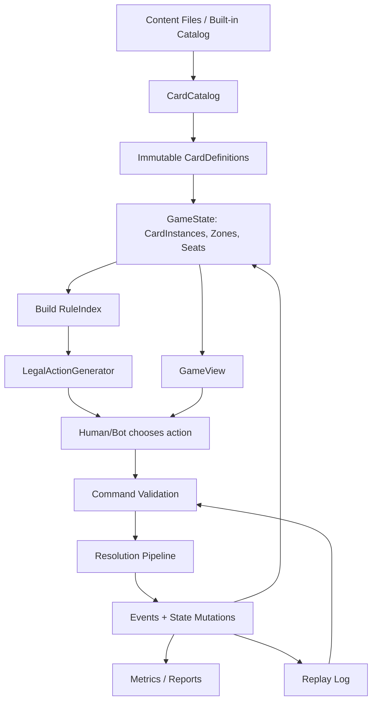

# 01 — Architecture Overview

## Executive decision

Do **not** extend the current simulator into the final game engine.

Do **not** throw away the knowledge produced by the current simulator.

Use this strategy instead:

```text
Current simulator = reference engine / rule notebook / diagnostic oracle
New engine        = clean deterministic battle engine
```

The current engine has value because it already revealed real design facts:

```text
- Evolution can fail to appear if the action model is wrong.
- L3 hard-cast must be explicitly controlled.
- Mythic recall / downward evolution must be forbidden.
- Pack needs precise attack-slot semantics.
- Ancestors, Presence, Prepared Tactics, Fade, Recall, Wounded, Shrines, Memory, and Offerings already interact enough to justify a cleaner engine.
```

But if the current engine is structurally unlike the desired engine, then a classical class-by-class refactor is the wrong path.

The right move is:

```text
Parallel clean rewrite + reference validation
```

## Four architectures used together

The game should be split into four major architectural layers:

```text
1. Deterministic battle engine
2. Data-driven content catalog
3. Mode/application layer
4. UI/network/adapters layer
```

### 1. Deterministic battle engine

The battle engine knows the rules of a single duel.

It should be:

```text
headless
deterministic
replayable
testable
server-authoritative ready
independent of UI
independent of roguelite mode
independent of persistence
```

It owns:

```text
GameState
Commands
Legal actions
Resolution pipeline
Rule modules
RuleIndex
Events
Combat
Evolution
Zones
Win conditions
```

It must not own:

```text
UI rendering
player accounts
save files
roguelite map
rewards
collection economy
network transport
database
```

### 2. Data-driven content catalog

The catalog defines what exists:

```text
cards
decks
shrines
ancestors
factions
keywords
starter packages
test decks
boss decks
encounter decks
```

The catalog is data-driven, but complex behavior remains in C# rule modules for now.

Good split:

```text
Data:
  name, cost, level, attack, vitality, tags, faction, rarity, deck membership

C#:
  complex keyword behavior, replacement effects, triggers, targeting, special resolution
```

### 3. Mode/application layer

The mode layer knows why a battle exists.

Examples:

```text
Single battle
Human vs bot
Bot vs bot simulation
Roguelite run
Tutorial encounter
Challenge encounter
Future PvP match
```

The mode layer may modify inputs into the battle engine:

```text
deck alterations
special encounter rules
starting shrine state
temporary relics
run rewards
AI behavior
```

But it must not fork the core battle rules randomly.

### 4. UI/network/adapters layer

The UI presents state and collects choices.

It does not own rules.

The network layer transports commands and events.

It does not own rules.

Future PvP should be possible because the authoritative path is:

```text
Client chooses legal action
Server validates command
Server resolves command
Server emits event log / state diff
Clients display result
```

## The core slogan

```text
Catalog defines what exists.
GameState defines what is true now.
RuleIndex defines what can react now.
Pipeline defines what happens next.
Events define what happened.
Views define what each player is allowed to know.
```

## Main architecture diagram



## Recommended first vertical slice

Do not build a beautiful UI first.

Do not build a complete engine first.

Build:

```text
New minimal engine
+ crude human-vs-bot runner
+ legal action generation
+ event log
```

First playable goal:

```text
Seat1(red.hunter) vs Seat2(iron.hyena)
Human controls Seat1.
Simple bot controls Seat2.
The game can finish a duel.
```

Minimum mechanics for the first slice:

```text
draw
play Being
play simple Tactic
attack
block
damage
destroy
shrine damage / shrine break
end turn
win/loss
```

Then add:

```text
evolution
Pack
Fade
Prepared Tactics
Ancestors
Recall
Possession
more advanced keywords
```
